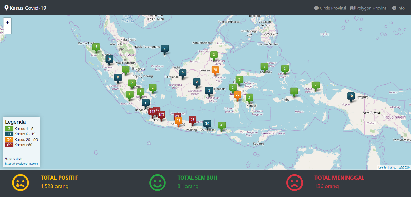
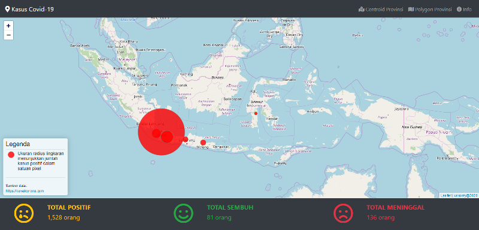
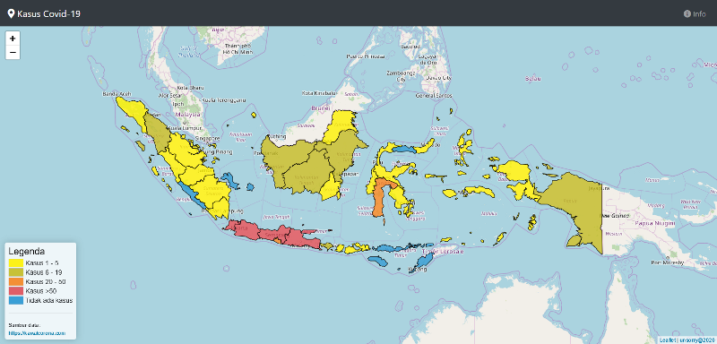

# geojsoncombine-corona

Repositori ini berisi tentang cara menampilkan data kasus COVID-19 dari [https://api.kawalcorona.com](https://api.kawalcorona.com) ke dalam peta web interaktif menggunakan Leaflet JS dengan metode join data GeoJSON dan data JSON menggunakan PHP.

## Data api.kawalcorona.com
Data API kasus COVID-19 yang disediakan untuk wilayah Indonesia berupa jumlah total kasus positif, kasus sembuh, dan kasus meninggal yang ada di [https://api.kawalcorona.com/indonesia/](https://api.kawalcorona.com/indonesia/).

Data API pada level Provinsi yang ada di [https://api.kawalcorona.com/indonesia/provinsi/](https://api.kawalcorona.com/indonesia/provinsi/) berisi data kode provinsi, nama provinsi, jumlah kasus positif, kasus sembuh, dan kasus meninggal. Data api ini hanya berupa data json sehingga tidak memiliki geometri untuk menunjukkan lokasi jadi tidak bisa secara langsung ditampilkan ke dalam peta web interaktif.

## Data GeoJSON
Data GeoJSON yang digunakan untuk menunjukkan lokasi kasus COVID-19 berupa **_centroid_ Provinsi** (istilah gampangnya titik tengah yang mewakili wilayah Provinsi) dan **_polygon_ Provinsi** yang sudah tersedia di folder **data**. Kedua data GeoJSON tersebut hanya memiliki atribut berupa Kode Provinsi (_Kode_Provi_) dan Nama Provinsi (_PROV_).

## Menggabungkan Data
Menggabungkan/_combine_/_join_ data dalam GIS biasa dilakukan pada data SHP dengan data Excel, tapi dalam kasus ini data yang tersedia berupa data geojson dengan data json. Dengan menggunakan PHP kita akan mudah menggabungkan kedua data tersebut menjadi data geojson baru. Prinsipnya sama, yaitu penggabungan/_combine_/_join_ berdasarkan pada _field_ kunci (_key field_) yang isinya sama dari kedua data tersebut yaitu Kode Provinsi (_Kode_Provi_).

Contoh _response_ data geojson gabungan _centroid provinsi_

`
{"type":"FeatureCollection","name":"provinsi_point","crs":{"type":"name","properties":{"name":"urn:ogc:def:crs:OGC:1.3:CRS84"}},"features":[{"type":"Feature","properties":{"Kode_Provi":34,"PROV":"D.I. Yogyakarta","Kasus_Positif":18,"Kasus_Sembuh":1,"Kasus_Meninggal":2},"geometry":{"type":"Point","coordinates":[110.44777527914573,-7.893691158590403]}}]}
`

##
Dengan data kasus COVID-19 yang mengambil langsung dari [https://api.kawalcorona.com/indonesia/provinsi/](https://api.kawalcorona.com/indonesia/provinsi/) maka data yang ditampilkan pada peta web ini akan otomatis berubah ketika data kasus COVID-19 dari [https://api.kawalcorona.com/indonesia/provinsi/](https://api.kawalcorona.com/indonesia/provinsi/) tersebut berubah.

Klasifikasi kasus COVID-19 yang ditampilkan pada peta web ini berdasarkan pada klasifikasi dari BNPB.

_Screenshot_ Peta Web COVID-19

##
**Demo**

[https://www.unsorry.net/git/geojsoncombine-corona](https://www.unsorry.net/git/geojsoncombine-corona)

##
>unsorry@2020